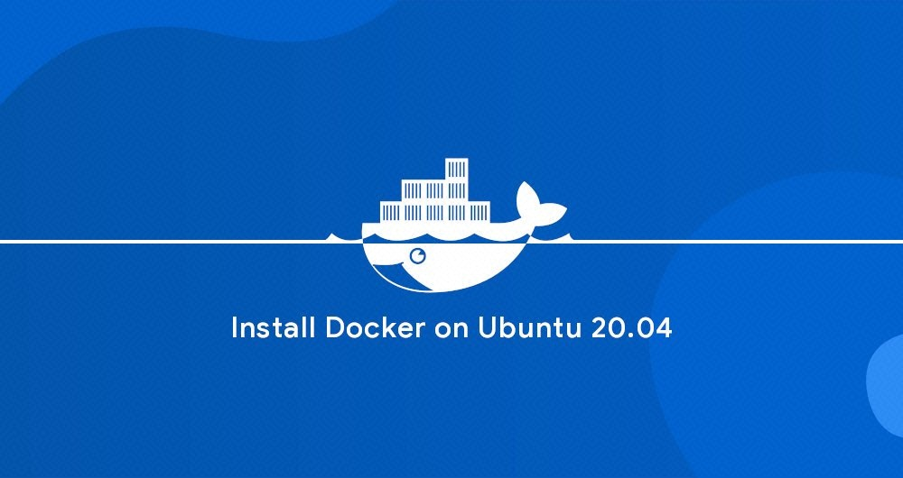
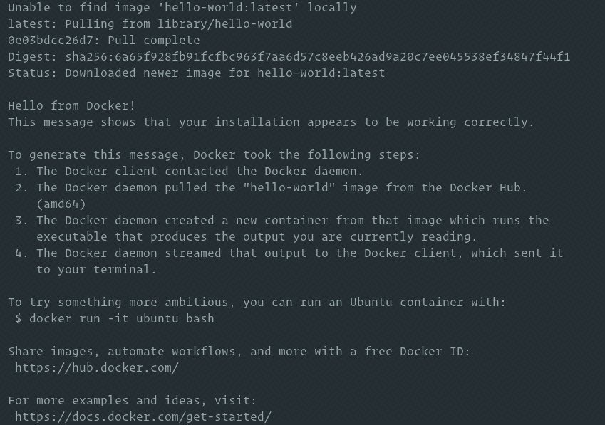
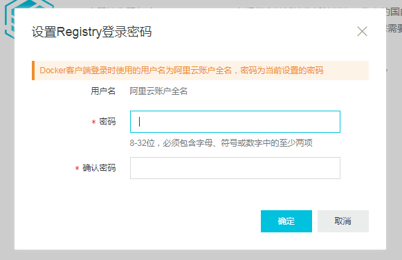

[TOC]

# 如何在 Ubuntu 20.04 上安装和使用 Docker

**简介：** Docker 是一个开源的容器化平台，是现代软件开发，持续集成，持续交付的一部分。本文主要为大家讲解如何在 Ubuntu 上安装和使用 Docker。

镜像下载、域名解析、时间同步请点击 [阿里巴巴开源镜像站](https://developer.aliyun.com/mirror?spm=a2c6h.12873639.0.0.68f8466bfC1goW)

Docker 是一个开源的容器化平台，你可以用它来构建，测试，并且作为可移动的容器去部署应用，这些容器可以在任何地方运行。一个容器表示一个应用的运行环境，并且包含软件运行所需要的所有依赖软件。
Docker 是现代软件开发，持续集成，持续交付的一部分。
本文将为大家介绍如何在 Ubuntu 上安装 Docker。
Docker 在标准的 Ubuntu 20.04 软件源中可用，但是可能不是最新的版本。我们将会从 Docker 的官方软件源中安装最新的 Docker 软件包。

## 一、安装 Docker

在 Ubuntu 上安装 Docker 非常方便。通过 Docker 软件源，导入 GPG key，就可以安装软件包。
首先，更新软件包索引，并且安装必要的依赖软件，来添加一个新的 HTTPS 软件源：

```
sudo apt update
sudo apt install apt-transport-https ca-certificates curl gnupg-agent software-properties-common
```

使用下面的 curl 导入源仓库的 GPG key：

```
curl -fsSL https://download.docker.com/linux/ubuntu/gpg | sudo apt-key add -
```

将 Docker APT 软件源添加到你的系统：

```
sudo add-apt-repository "deb [arch=amd64] https://download.docker.com/linux/ubuntu $(lsb_release -cs) stable"
```

现在，Docker 软件源被启用了，你可以安装软件源中任何可用的 Docker 版本。
a. 运行下面的命令来安装 Docker 最新版本。

```
sudo apt update
sudo apt install docker-ce docker-ce-cli containerd.io
```

1. 安装指定版本的Docker，首先列出 Docker 软件源中所有可用的版本：

```
sudo apt update
apt list -a docker-ce
```

可用的 Docker 版本将会在第二列显示。如下所示在官方 Docker 软件源中只有一个 Docker 版本（5:19.03.9~3-0~ubuntu-focal）可用：

```
docker-ce/focal 5:19.03.9~3-0~ubuntu-focal amd64
```

通过在软件包名后面添加版本`=<VERSION>`来安装指定版本：

```
sudo apt install docker-ce=<VERSION> docker-ce-cli=<VERSION> containerd.io
```

安装完成后，Docker 服务将会自动启动。输入下面的命令来验证：

```
sudo systemctl status docker
```

输出界面如下：

```
● docker.service - Docker Application Container Engine
     Loaded: loaded (/lib/systemd/system/docker.service; enabled; vendor preset: enabled)
     Active: active (running) since Thu 2020-05-21 14:47:34 UTC; 42s ago
...
```

当新的 Docker 发布时，你可以使用`sudo apt update && sudo apt upgrade`命令来升级 Docker 软件包。
你可以通过锁定Docker的版本来阻止 Docker 自动更新：

```
sudo apt-mark hold docker-ce
```


## 二、以非 Root 用户身份执行 Docker

默认情况下，只有 root 或者 有 sudo 权限的用户可以执行 Docker 命令。
想要以非 root 用户执行 Docker 命令，你需要将你的用户添加到 Docker 用户组，该用户组是在 Docker CE 软件包安装过程中创建的。

```
sudo usermod -aG docker $USER
```

`$USER`是一个环境变量，代表当前用户名。
登出，并且重新登录，以便用户组会员信息刷新。

## 三、验证安装过程

想要验证 Docker 是否已经成功被安装，你可以执行`docker`命令，前面不需要加`sudo, 会自动运行一个测试容器:

```
docker container run hello-world
```

如果本地没有该镜像，该命令将会自动下载测试镜像，并在容器中运行，输出“Hello from Docker”后退出。
输出结果如下：

Docker将会在输出结果后停止运行。
默认情况下，Docker 从 Docker Hub 拉取镜像。它是一个云端服务，主要用来储存 公有和私有源中的 Docker 镜像。

## 四、卸载 Docker

在卸载 Docker 之前，你最好移除所有的容器，镜像，卷和网络。
运行下面的命令停止所有正在运行的容器，并且移除所有的 docker 对象:

```
docker container stop $(docker container ls -aq)
docker system prune -a --volumes
```

接下来你可以使用`apt命令`来卸载 Docker：

```
sudo apt purge docker-ce
sudo apt autoremove
```

> “ [阿里巴巴开源镜像站](https://developer.aliyun.com/mirror?spm=a2c6h.12873639.0.0.68f8466bfC1goW) 提供全面，高效和稳定的镜像下载服务。钉钉搜索 **' 21746399 ‘** 加入镜像站官方用户交流群。”


# [Docker配置阿里云镜像加速](https://www.cnblogs.com/allenjing/p/12575972.html)


访问 https://help.aliyun.com/document_detail/60750.html

[](https://img2018.cnblogs.com/blog/813478/201908/813478-20190823181935432-1166495470.png)

点击进入控制台

[](https://img2018.cnblogs.com/blog/813478/201908/813478-20190823182011320-1762498244.png)

前往开通

[](https://img2018.cnblogs.com/blog/813478/201908/813478-20190823182044925-1854941092.png)

设置密码

[](https://img2018.cnblogs.com/blog/813478/201908/813478-20190823182111766-262850407.png)

确定，进来后，点击**镜像加速器**

[](https://img2018.cnblogs.com/blog/813478/201908/813478-20190823183017117-410380231.png)

就冒出来配置方法，很简单的，就是拿到加速地址，然后去搞个json文件即可。

```
vim /etc/docker/daemon.json

# 添加如下内容，具体地址自己申请咯
{
  "registry-mirrors": ["https://****.mirror.aliyuncs.com"]
}

# 重启服务
systemctl daemon-reload
systemctl restart docker
```

候查看docker信息

```
[root@localhost admin]# docker info
Containers: 5
 Running: 0
 Paused: 0
 Stopped: 5
Images: 5
Server Version: 1.13.1
Storage Driver: overlay2
 Backing Filesystem: xfs
 Supports d_type: true
 Native Overlay Diff: true
Logging Driver: journald
Cgroup Driver: systemd
Plugins: 
 Volume: local
 Network: bridge host macvlan null overlay
Swarm: inactive
Runtimes: docker-runc runc
Default Runtime: docker-runc
Init Binary: /usr/libexec/docker/docker-init-current
containerd version:  (expected: aa8187dbd3b7ad67d8e5e3a15115d3eef43a7ed1)
runc version: 5eda6f6fd0c2884c2c8e78a6e7119e8d0ecedb77 (expected: 9df8b306d01f59d3a8029be411de015b7304dd8f)
init version: fec3683b971d9c3ef73f284f176672c44b448662 (expected: 949e6facb77383876aeff8a6944dde66b3089574)
Security Options:
 seccomp
  WARNING: You're not using the default seccomp profile
  Profile: /etc/docker/seccomp.json
 selinux
Kernel Version: 3.10.0-862.9.1.el7.x86_64
Operating System: CentOS Linux 7 (Core)
OSType: linux
Architecture: x86_64
Number of Docker Hooks: 3
CPUs: 1
Total Memory: 974.6 MiB
Name: localhost.localdomain
ID: RKLD:HVRZ:AAX6:O36J:264Q:QAF6:EHO6:2VCI:AA3M:445E:266Y:KCKU
Docker Root Dir: /var/lib/docker
Debug Mode (client): false
Debug Mode (server): false
Registry: https://index.docker.io/v1/
Experimental: false
Insecure Registries:
 127.0.0.0/8
Registry Mirrors:
 https://****.mirror.aliyuncs.com
Live Restore Enabled: false
Registries: docker.io (secure)
```

