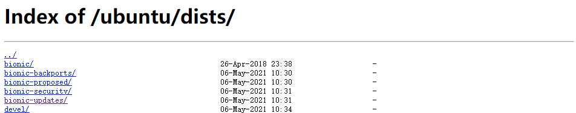

[toc]

# 1 系统配置

## 1.1 配置阿里云源

### 1.1.1 备份原来的源

```
cp -ra /etc/apt/sources.list /etc/apt/sources.list.bak
```

> ubuntu 代号
>
> 16.04(LTS) Xenial Xerus (好客的非洲地松鼠)
>
> 18.04(LTS) Bionic Beaver（仿生海狸）
>
> 20.04(LTS) Focal Fossa（专注的马达加斯加长尾狸猫）
>
> …

要知道当前系统的代号，可以用以下命令：

```
lsb_release -a

No LSB modules are available.
Distributor ID: Ubuntu
Description:    Ubuntu 20.04.1 LTS
Release:        20.04
Codename:       focal
```

### 1.1.2 阿里云源地址

http://mirrors.aliyun.com/ubuntu/dists/


### 1.1.3 更改模板

```
deb     http://mirrors.aliyun.com/ubuntu/ CODE_NAME main restricted universe multiverse
deb-src http://mirrors.aliyun.com/ubuntu/ CODE_NAME main restricted universe multiverse
deb     http://mirrors.aliyun.com/ubuntu/ CODE_NAME-security main restricted universe multiverse
deb-src http://mirrors.aliyun.com/ubuntu/ CODE_NAME-security main restricted universe multiverse
deb     http://mirrors.aliyun.com/ubuntu/ CODE_NAME-updates main restricted universe multiverse
deb-src http://mirrors.aliyun.com/ubuntu/ CODE_NAME-updates main restricted universe multiverse
deb     http://mirrors.aliyun.com/ubuntu/ CODE_NAME-proposed main restricted universe multiverse
deb-src http://mirrors.aliyun.com/ubuntu/ CODE_NAME-proposed main restricted universe multiverse
deb     http://mirrors.aliyun.com/ubuntu/ CODE_NAME-backports main restricted universe multiverse
deb-src http://mirrors.aliyun.com/ubuntu/ CODE_NAME-backports main restricted universe multiverse
```

把 CODE_NAME 更改为响应的代号名称，如：ubuntu20.4，代号：focal，更换后为：

```
deb     http://mirrors.aliyun.com/ubuntu/ focal main restricted universe multiverse
deb-src http://mirrors.aliyun.com/ubuntu/ focal main restricted universe multiverse
deb     http://mirrors.aliyun.com/ubuntu/ focal-security main restricted universe multiverse
deb-src http://mirrors.aliyun.com/ubuntu/ focal-security main restricted universe multiverse
deb     http://mirrors.aliyun.com/ubuntu/ focal-updates main restricted universe multiverse
deb-src http://mirrors.aliyun.com/ubuntu/ focal-updates main restricted universe multiverse
deb     http://mirrors.aliyun.com/ubuntu/ focal-proposed main restricted universe multiverse
deb-src http://mirrors.aliyun.com/ubuntu/ focal-proposed main restricted universe multiverse
deb     http://mirrors.aliyun.com/ubuntu/ focal-backports main restricted universe multiverse
deb-src http://mirrors.aliyun.com/ubuntu/ focal-backports main restricted universe multiverse
```

然后粘贴到`/etc/apt/sources.list`里

### 1.1.4 更新缓存和升级

```
sudo apt-get update
sudo apt-get upgrade
```


---


## 1.2 VirtualBox设置内外网访问

- 打开虚拟机网络设置；
- 网卡1 设置为：网络地址转换“，网卡2设置为：仅主机（Host-Only）模式。


---


## 1.3 更改主机名称


---


## 1.4 安装ssh-server服务

### 1.4.1 检查安装状态

 查看当前的ubuntu是否安装了ssh-server服务。默认只安装ssh-client服务

~~~
dpkg -l | grep ssh
~~~

### 1.4.2 安装ssh-server服务

```
sudo apt install openssh-server
```


---


## 1.5 netplan 设置 ip地址

~~~
sudo vim /etc/netplan/01-network-manager-all.yaml

# Let NetworkManager manage all devices on this system
network:
  version: 2
  renderer: NetworkManager
  ethernets:  
    enp0s8:
      addresses: [192.168.56.102/24]
      dhcp4: no
      optional: true
~~~

`netplan` 操作命令提供两个子命令：

- `netplan generate` ：以 `/etc/netplan` 配置为管理工具生成配置；
- `netplan apply` ：应用配置(以便生效)，必要时重启管理工具；

