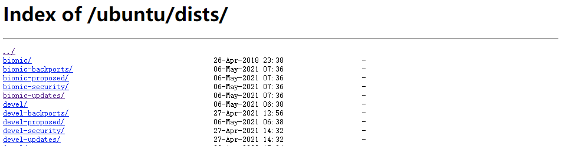

[toc]

# 系统配置

## 配置阿里云源

### 备份原来的源

```
cp -ra /etc/apt/sources.list /etc/apt/sources.list.bak
```

> ubuntu 代号
>
> 16.04(LTS) Xenial Xerus (好客的非洲地松鼠)
>
> 18.04(LTS) Bionic Beaver（仿生海狸）
>
> 20.04(LTS) Focal Fossa（专注的马达加斯加长尾狸猫）
>
> …

要知道当前系统的代号，可以用以下命令：

```
lsb_release -a

No LSB modules are available.
Distributor ID: Ubuntu
Description:    Ubuntu 20.04.1 LTS
Release:        20.04
Codename:       focal
```

### 阿里云源地址

http://mirrors.aliyun.com/ubuntu/dists/



### 更改模板

```
deb     http://mirrors.aliyun.com/ubuntu/ CODE_NAME main restricted universe multiverse
deb-src http://mirrors.aliyun.com/ubuntu/ CODE_NAME main restricted universe multiverse
deb     http://mirrors.aliyun.com/ubuntu/ CODE_NAME-security main restricted universe multiverse
deb-src http://mirrors.aliyun.com/ubuntu/ CODE_NAME-security main restricted universe multiverse
deb     http://mirrors.aliyun.com/ubuntu/ CODE_NAME-updates main restricted universe multiverse
deb-src http://mirrors.aliyun.com/ubuntu/ CODE_NAME-updates main restricted universe multiverse
deb     http://mirrors.aliyun.com/ubuntu/ CODE_NAME-proposed main restricted universe multiverse
deb-src http://mirrors.aliyun.com/ubuntu/ CODE_NAME-proposed main restricted universe multiverse
deb     http://mirrors.aliyun.com/ubuntu/ CODE_NAME-backports main restricted universe multiverse
deb-src http://mirrors.aliyun.com/ubuntu/ CODE_NAME-backports main restricted universe multiverse
```

把 CODE_NAME 更改为响应的代号名称，如：ubuntu20.4，代号：focal，更换后为：

```
deb     http://mirrors.aliyun.com/ubuntu/ focal main restricted universe multiverse
deb-src http://mirrors.aliyun.com/ubuntu/ focal main restricted universe multiverse
deb     http://mirrors.aliyun.com/ubuntu/ focal-security main restricted universe multiverse
deb-src http://mirrors.aliyun.com/ubuntu/ focal-security main restricted universe multiverse
deb     http://mirrors.aliyun.com/ubuntu/ focal-updates main restricted universe multiverse
deb-src http://mirrors.aliyun.com/ubuntu/ focal-updates main restricted universe multiverse
deb     http://mirrors.aliyun.com/ubuntu/ focal-proposed main restricted universe multiverse
deb-src http://mirrors.aliyun.com/ubuntu/ focal-proposed main restricted universe multiverse
deb     http://mirrors.aliyun.com/ubuntu/ focal-backports main restricted universe multiverse
deb-src http://mirrors.aliyun.com/ubuntu/ focal-backports main restricted universe multiverse
```

然后粘贴到`/etc/apt/sources.list`里

### 更新缓存和升级

```
sudo apt-get update
sudo apt-get upgrade
```

## 更改主机名称

